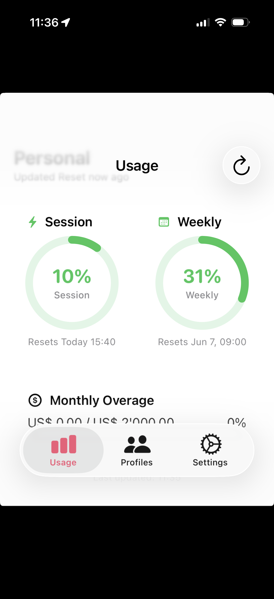
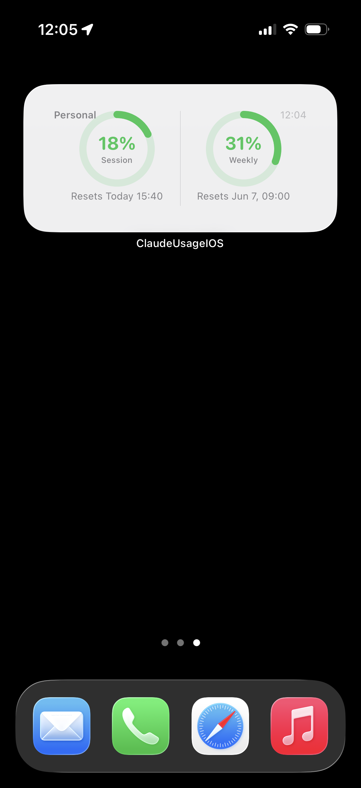

# Claude Usage Tracker — iOS Companion App

> **⚠️ Proof of Concept — Not production-ready**
> This app was built as a quick feasibility exercise. The UI has not been properly designed and is visibly rough around the edges. Treat it as a starting point, not a finished product.

An iOS companion to [Claude Usage Tracker](https://github.com/hamed-elfayome/Claude-Usage-Tracker), the macOS menu bar app for monitoring your Claude AI usage. Shows session and weekly usage on your iPhone, stores credentials in the iOS Keychain, and provides a WidgetKit home screen widget.

## Screenshots

<table>
  <tr>
    <td align="center"><br/><sub>Usage dashboard</sub></td>
    <td align="center"><br/><sub>Medium home screen widget</sub></td>
  </tr>
</table>

## Features

- **Usage Dashboard** — Session (5-hour) and Weekly (7-day) usage gauges with colour-coded status
- **Model Breakdown** — Opus and Sonnet weekly usage bars
- **Overage Tracking** — Monthly cost limit and credit grant balance (when configured)
- **Multi-Profile** — Create and switch between multiple Claude accounts
- **Keychain Storage** — Session keys stored in iOS Keychain (`kSecAttrAccessibleWhenUnlockedThisDeviceOnly`)
- **Manual Session Key Entry** — Paste your `sk-ant-…` session key; org ID is fetched automatically
- **WidgetKit Widget** — Small (2×2) and Medium (4×2) home screen widgets that refresh every 15 minutes
- **Auto-refresh** — Configurable interval (15 s – 15 min)
- **Notifications** — Opt-in alerts at 75%, 90%, and 95% thresholds

## What was NOT ported

- Terminal status line (no CLI on iOS)
- Claude Code CLI / OAuth sync (no shell access on iOS)
- Menu bar integration (iOS has no menu bar)
- Launch-at-login, Sparkle auto-updates, NSPopover, NSStatusBar

## Project Setup

### Prerequisites

- Xcode 16 or later
- iOS 17.0+ deployment target
- An Apple Developer account (free tier works for device testing)
- [xcodegen](https://github.com/yonaskolb/XcodeGen) (`brew install xcodegen`)

### Generate the Xcode Project

```bash
cd /Users/donald/Documents/Development/Claude-Usage-Tracker-iOS
brew install xcodegen   # skip if already installed
xcodegen generate
```

This produces `ClaudeUsageIOS.xcodeproj`. Open it in Xcode:

```bash
open ClaudeUsageIOS.xcodeproj
```

### Manual Xcode Setup (without xcodegen)

If you prefer to set up manually:

1. **Create a new iOS App project** in Xcode  
   - Product Name: `ClaudeUsageIOS`  
   - Bundle ID: `org.afaik.claudeusagetracker.ios`  
   - Interface: SwiftUI  
   - Language: Swift

2. **Add a Widget Extension target**  
   File → New → Target → Widget Extension  
   - Product Name: `ClaudeUsageWidget`  
   - Bundle ID: `org.afaik.claudeusagetracker.ios.widget`  
   - Uncheck "Include Configuration App Intent"

3. **Add source files to each target**

   | Files | Target |
   |-------|--------|
   | `Shared/*.swift` | Both `ClaudeUsageIOS` and `ClaudeUsageWidget` |
   | `ClaudeUsageIOS/**/*.swift` | `ClaudeUsageIOS` only |
   | `ClaudeUsageWidget/*.swift` | `ClaudeUsageWidget` only |

4. **Configure App Groups** (required for widget data sharing)  
   - Select the `ClaudeUsageIOS` target → Signing & Capabilities → + Capability → App Groups  
   - Add: `group.org.afaik.claudeusagetracker.shared`  
   - Repeat for the `ClaudeUsageWidget` target

5. **Set Keychain Sharing** (optional, recommended)  
   - `ClaudeUsageIOS` target → + Capability → Keychain Sharing  
   - Add: `org.afaik.claudeusagetracker.ios`

6. **Link WidgetKit** to the main app target (for `WidgetCenter.shared.reloadAllTimelines()`)  
   - `ClaudeUsageIOS` target → Build Phases → Link Binary With Libraries → `WidgetKit.framework`

7. **Copy entitlements** from the provided `.entitlements` files to your target settings.

### Signing

Set your development team in both targets:  
Project navigator → `ClaudeUsageIOS.xcodeproj` → each target → Signing & Capabilities → Team.

---

## Getting Your Session Key

1. Open [claude.ai](https://claude.ai) in Safari on your Mac (or in iOS Safari with DevTools via remote inspector)
2. Open DevTools → Application → Cookies → `claude.ai`
3. Copy the **value** of the `sessionKey` cookie (starts with `sk-ant-`)
4. Paste it into the app under Profiles → your profile → Edit → Session Key → Test & Fetch Orgs → Save

The session key is stored exclusively in the iOS Keychain. The org ID is fetched automatically on first use and cached in the profile.

---

## Architecture

```
Shared/                         # Compiled into both app and widget
  ClaudeUsage.swift             # Core data model (session, weekly, per-model)
  Constants.swift               # App Group ID, API base URLs, limits
  Date+Extensions.swift         # timeRemainingString(), resetTimeString()

ClaudeUsageIOS/
  App/
    ClaudeUsageIOSApp.swift     # @main entry
    AppState.swift              # @MainActor ObservableObject, owns refresh loop
  Models/
    Profile.swift               # Credentials + settings per account
    APIUsage.swift              # API Console billing model
    NotificationSettings.swift  # Per-profile notification thresholds
  Services/
    ClaudeAPIService.swift      # URLSession API calls (session key auth only)
    KeychainService.swift       # iOS Keychain wrapper (Security.framework)
    ProfileManager.swift        # Profile CRUD (UserDefaults persistence)
    NetworkMonitor.swift        # NWPathMonitor — auto-refresh on reconnect
  Utilities/
    AppError.swift              # Typed error with codes and recovery hints
    SessionKeyValidator.swift   # Validates sk-ant-… format
    URLBuilder.swift            # Safe URL construction
    UsageStatusCalculator.swift # safe/moderate/critical thresholds
  Storage/
    AppGroupStore.swift         # Writes to App Group UserDefaults + reloads widget
  Views/
    ContentView.swift           # Tab view (Usage, Profiles, Settings)
    UsageView.swift             # Dashboard with gauges, model breakdown, overage
    UsageGaugeView.swift        # Reusable circular gauge component
    CredentialsView.swift       # Session key onboarding/entry
    ProfilesView.swift          # Profile list with activate/delete
    ProfileDetailView.swift     # Edit name, session key, org ID
    SettingsView.swift          # Refresh interval, notifications, about

ClaudeUsageWidget/
  ClaudeUsageWidgetBundle.swift # @main WidgetBundle
  ClaudeUsageWidget.swift       # Provider + Small/Medium widget views
  WidgetEntry.swift             # TimelineEntry
```

### Widget Data Flow

```
App refresh → ClaudeAPIService → ClaudeUsage
    ↓
AppGroupStore.writeUsage()
    → UserDefaults(group.com.claudeusagetracker.shared)
    → WidgetCenter.shared.reloadAllTimelines()

Widget Provider.getTimeline()
    → WidgetDataStore.readUsage()
    → UserDefaults(group.com.claudeusagetracker.shared)
    → ClaudeUsageEntry → rendered by SmallWidgetView / MediumWidgetView
```

---

## Bundle IDs

| Target | Bundle ID |
|--------|-----------|
| Main app | `org.afaik.claudeusagetracker.ios` |
| Widget | `org.afaik.claudeusagetracker.ios.widget` |
| App Group | `group.org.afaik.claudeusagetracker.shared` |

To use a different bundle ID prefix, replace `org.afaik.claudeusagetracker` in `project.pbxproj`, both `.entitlements` files, `Constants.swift`, and the `WidgetDataStore` suite name in `ClaudeUsageWidget.swift`.

---

## License

[MIT](LICENSE)
